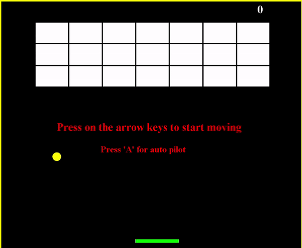

# The Game
Brick Breaker is a game which the player must smash a wall of bricks by deflecting a bouncing ball with a paddle.
The paddle move horizontally and is controlled with the left and right arrows keys. 
Each brick that have been destroyed worth 5 points.
When all the bricks have been destroyed, the player advances to a new, harder level. There are 3 levels.

KEYS:
SPACE = continue to new level
ENTER = start the saim level again
A = auto pilot

